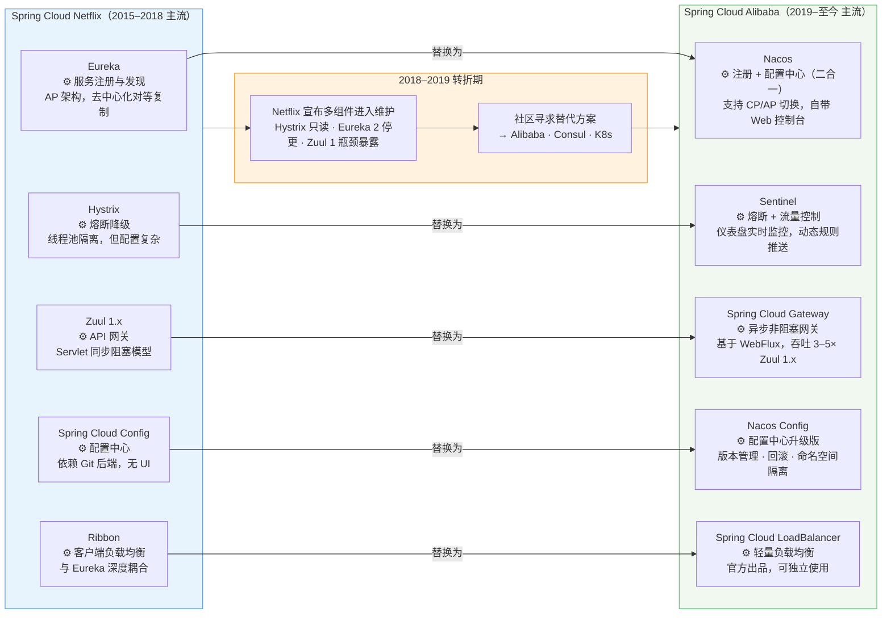
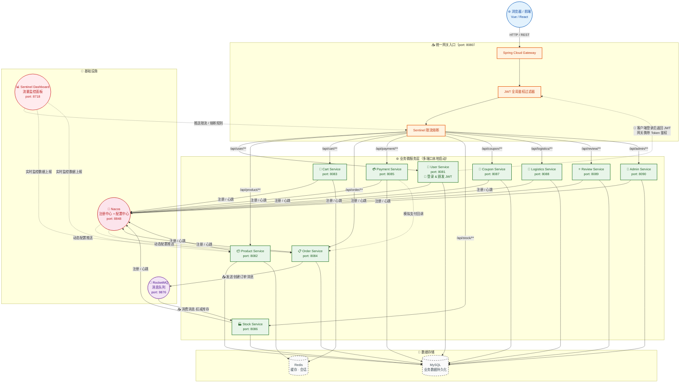

# 电商场景微服务落地分析报告

> 适用场景：大学期末大作业 · 本地 PC 演示 · 单机多端口部署

---

## 一、技术的必要性——单体架构撑不住电商业务

一个典型的电商系统包含约 10 个功能模块：用户、商品、订单、购物车、支付模拟、库存、优惠券、物流、评价、后台管理。如果采用单体架构，在本地开发和演示阶段就会面临以下痛点：

1. **编译和启动慢**：10 个模块共用一个工程，哪怕只改一行代码也要重新编译整个项目；对于期末答辩演示来说，每次修改都要等待 2–3 分钟构建，影响调试效率。
2. **协作冲突**：小组作业中多名同学负责不同模块，在单体仓库中容易产生代码冲突。微服务将每个模块拆为独立 Maven 子工程，各成员可独立开发、互不干扰。
3. **故障不隔离**：如果购物车模块有死循环或 OOM，整个进程崩溃，支付演示和商品查询都跟着无法展示。微服务架构下每个模块是独立 JVM 进程，一个模块崩溃不影响其他模块的正常演示。
4. **无法针对性演示扩展性**：课程评分中往往会考察"高并发应对"，单体只能演示启动多个完整应用副本（浪费资源），而微服务可以只对热点服务（如商品查询）启动多实例，展示更精细的扩缩容思路。

> **结论**：微服务不仅是大厂的"炫技"，在课程作业中也能切实提升团队协作效率、系统稳定性和演示的"技术含金量"。

---

## 二、适配性——Spring Cloud Alibaba 组件如何嵌入电商演示

本地演示采用 **Spring Cloud Alibaba** 技术栈，所有中间件均可通过 Docker Compose 一键启动。以下按电商请求链路进行说明：

```
浏览器 → Spring Cloud Gateway → 各微服务 → 数据库/中间件
                                 ↓ 注册到 Nacos
                                 ↓ 限流/熔断由 Sentinel 管控
                                 ↓ 异步消息走 RocketMQ
```

### Nacos（注册中心 + 配置中心）

- **注册中心**：本地启动 10 个微服务后，所有服务自动在 Nacos 控制台（`localhost:8848`）注册，无需手动维护 IP 地址列表。演示时可以直观展示服务健康状态、上下线感知。
- **配置中心**：将数据库连接、业务开关配置放到 Nacos Config 中。演示场景下，修改"订单超时时间"或"商品默认图片地址"后实时生效，无需重新启动服务，这是一个很好的答辩加分亮点。

### Sentinel（限流与熔断）

- **限流演示**：在 Sentinel Dashboard 中为秒杀的 `/order/create` 接口配置 QPS 阈值=5，然后用压测工具（JMeter）发送 20 并发请求，演示超出部分被直接拒绝并返回"系统繁忙"，直观展示限流效果。
- **熔断演示**：支付模拟服务故意设置 50% 的失败率，Sentinel 检测到异常比例超标后快速熔断，订单服务不再调用已降级的支付服务，演示雪崩保护。

### Spring Cloud Gateway（统一网关入口）

- 所有前端请求统一经过 Gateway（`localhost:8080`），Gateway 根据路由规则转发到对应服务：`/api/user/** → user-service`，`/api/product/** → product-service`。
- 网关层集中处理跨域、请求日志打印、JWT 校验，各微服务只需关注业务逻辑。

### RocketMQ（消息解耦与最终一致性演示）

- **订单→库存解耦**：订单创建后发送 RocketMQ 消息，库存服务异步消费扣减库存。演示时可以故意暂停库存服务，验证订单依然能成功创建——消息会在库存服务恢复后继续消费，展示最终一致性。
- **削峰填谷**：模拟秒杀场景下 100 个订单请求瞬间涌入，订单服务快速写入 MQ 即返回"下单成功"，后端消费服务按自身吞吐量逐步处理，避免数据库被打垮。

---

## 三、可演进性——基于 Docker Compose 的横向扩展与拆分

课程作业通常运行在单台笔记本上，无需 K8s 等重型调度平台，以下方案完全在本地可演示：

### 3.1 多实例横向扩展

假设演示过程中发现**商品查询服务**是热点（QPS 最高），可以在 IDE 或命令行中启动该服务的多个实例，绑定不同端口：

```bash
# 启动两个商品服务实例，分别注册到 Nacos
java -jar product-service.jar --server.port=8081
java -jar product-service.jar --server.port=8082
```

- 两个实例自动注册到 Nacos，Nacos 控制台页面会显示该服务有 2 个健康实例。
- Gateway 默认轮询负载均衡（Spring Cloud LoadBalancer），请求会被分发到两个实例。
- **演示话术**："当系统检测到商品服务的 CPU 使用率超过 70%（通过 Actuator 暴露指标），我们可以手动或通过脚本启动新的实例，Nacos 自动将其加入负载池，无需修改任何代码。——这就是微服务的弹性伸缩能力。"

如果使用 Docker Compose，可在 `docker-compose.yml` 中通过 `scale` 参数一键扩展：

```yaml
# docker-compose up --scale product-service=3 -d
product-service:
  image: ecom/product:latest
  ports:
    - "8081-8083:8080"
```

### 3.2 服务按需拆分

当前 10 个模块以单服务形式运行。如果未来业务量增长：

- **商品服务**可进一步拆分为 `product-basic-service`（基础信息）和 `product-stock-service`（库存），库存是热点且要求强一致，独立拆分后便于单独限流和扩容。
- **订单服务**可引入 ShardingSphere，将订单数据按 `order_id` 哈希分 4 张表，插入和查询压力分散到多个数据库。

### 3.3 Nacos 配置动态调整模拟流量变化

演示环境中，可以在 Nacos 控制台直接修改 Sentinel 限流规则：
- 日常模式：QPS = 5
- 大促模拟模式：QPS = 20

客户端无需重启，规则实时生效——这在单体架构中需要修改代码并重启才能实现。

---

## 四、安全性——网关统一鉴权 + Feign 内部 Token 传递

### 4.1 基于 JWT 的网关统一鉴权

考虑到课程演示的规模，采用简化的 JWT 鉴权方案，不引入 OAuth2 的复杂授权码流程：

```
客户端请求 → Spring Cloud Gateway
                ↓
        全局鉴权过滤器（GatewayFilter）
                ↓
    ⚠️ 检查 Authorization Header 是否携带 JWT
       ├── 无 Token：返回 401 Unauthorized
       └── 有 Token：验证签名 + 有效期（使用 JJWT 库）
                ↓
        从 JWT Payload 中解析 userId 和 role
                ↓
        对特定路由校验角色权限：
           /api/admin/** → 需要 role = "ADMIN"
           /api/order/** → 需要 role = "USER"
                ↓
        鉴权通过 → 将 userId 放入 Request Header 透传
        鉴权失败 → 返回 403 Forbidden
```

**本地演示时的具体实现建议：**

```java
// Gateway 过滤器核心逻辑（伪代码示意）
@Component
public class AuthGlobalFilter implements GlobalFilter, Ordered {

    @Override
    public Mono<Void> filter(ServerWebExchange exchange, GatewayFilterChain chain) {
        String token = exchange.getRequest().getHeaders().getFirst("Authorization");
        if (token == null || !JwtUtil.verify(token)) {
            exchange.getResponse().setStatusCode(HttpStatus.UNAUTHORIZED);
            return exchange.getResponse().setComplete();
        }
        Claims claims = JwtUtil.parse(token);
        // 将 userId 传递到下游
        ServerWebExchange mutated = exchange.mutate()
            .request(r -> r.header("X-User-Id", claims.get("userId").toString()))
            .build();
        return chain.filter(mutated);
    }
}
```

### 4.2 微服务间 Feign 调用携带 Token

当一个微服务需要调用另一个微服务时（例如订单服务调用用户服务获取地址信息），通过 Feign 拦截器自动传递 Token：

```java
// Feign 请求拦截器——自动传递 Token
@Component
public class FeignTokenInterceptor implements RequestInterceptor {
    @Override
    public void apply(RequestTemplate template) {
        // 从当前请求上下文中获取 Token
        ServletRequestAttributes attrs = (ServletRequestAttributes) RequestContextHolder.getRequestAttributes();
        if (attrs != null) {
            String token = attrs.getRequest().getHeader("Authorization");
            if (token != null) {
                template.header("Authorization", token);
                template.header("X-User-Id", attrs.getRequest().getHeader("X-User-Id"));
            }
        }
    }
}
```

接收方在需要时验证 Token 或直接信任 Header 中的 `X-User-Id`，完成用户身份的跨服务传递。

### 4.3 网关屏蔽内部接口

在 Gateway 的路由配置中，只暴露 `GET /api/product/**`、`POST /api/order/**`、`POST /api/cart/**` 等前端需要的接口路径。对于 Actuator 端点（`/actuator/**`）和内部管理接口，在网关层做过滤拦截，只允许内网或指定 IP 访问，防止敏感信息泄露。

---

## 附：Spring Cloud 生态演进图表



**核心替换关系总结：**

| 能力维度 | Netflix 体系（旧） | Alibaba 体系（新） | 替换理由 |
|---|---|---|---|
| 服务注册与发现 | Eureka | **Nacos** | Nacos 合二为一，同时管理配置，自带控制台，运维体验远优于 Eureka |
| 熔断降级 | Hystrix | **Sentinel** | Hystrix 停更；Sentinel 支持流量整形、实时监控、动态规则 |
| API 网关 | Zuul 1.x | **Spring Cloud Gateway** | Gateway 异步非阻塞，性能碾压同步 Zuul 1.x |
| 配置中心 | Config + Bus | **Nacos Config** | 无需额外集成消息总线即可实现配置实时刷新 |
| 负载均衡 | Ribbon | **Spring Cloud LoadBalancer** | Ribbon 停更；官方轻量替代，与 RestTemplate / WebClient 深度整合 |

---

*注：本文档基于 Spring Cloud Alibaba 2022.x 版本，所有演示方案均可在一台笔记本上通过 IDEA 多实例启动或 Docker Compose 完成。*

---

## 附：电商微服务系统架构图


